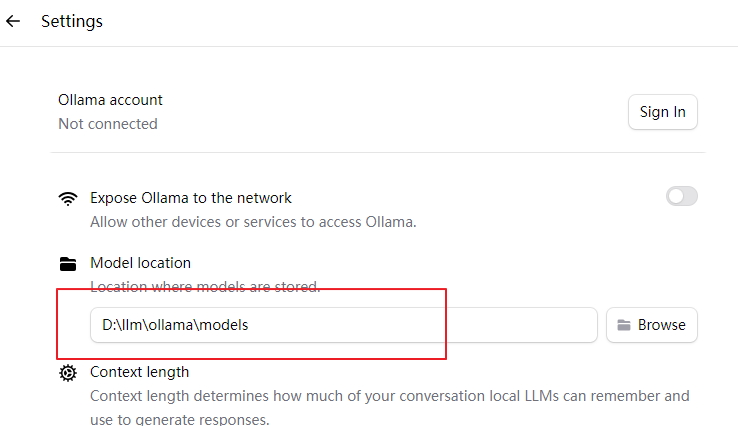
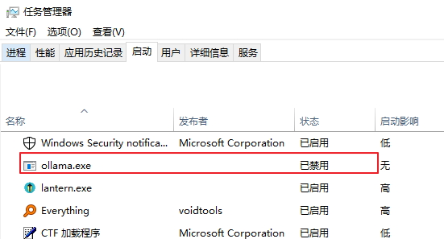
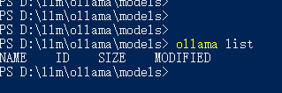

# 模型介绍
国内模型，bigmodel

https://open.bigmodel.cn/usercenter/proj-mgmt/apikeys

国外开源模型ollama

https://ollama.com/

# ollama使用
1、下载window版本：https://ollama.com/download/windows

2、双击ollama.exe安装，点击Install

3、ollama模型默认安装在C盘，可修改。

在图形界面修改不会作用于环境变量，还需要配置环境变量OLLAMA_MODELS=D:\llm\ollama\models

4、禁止ollama开机启动。

5、使用命令行使用ollama。ollama list 查看已下载的模型

ollama默认端口号是11434。Windows查看端口号：netstat -ano|findstr 11434

